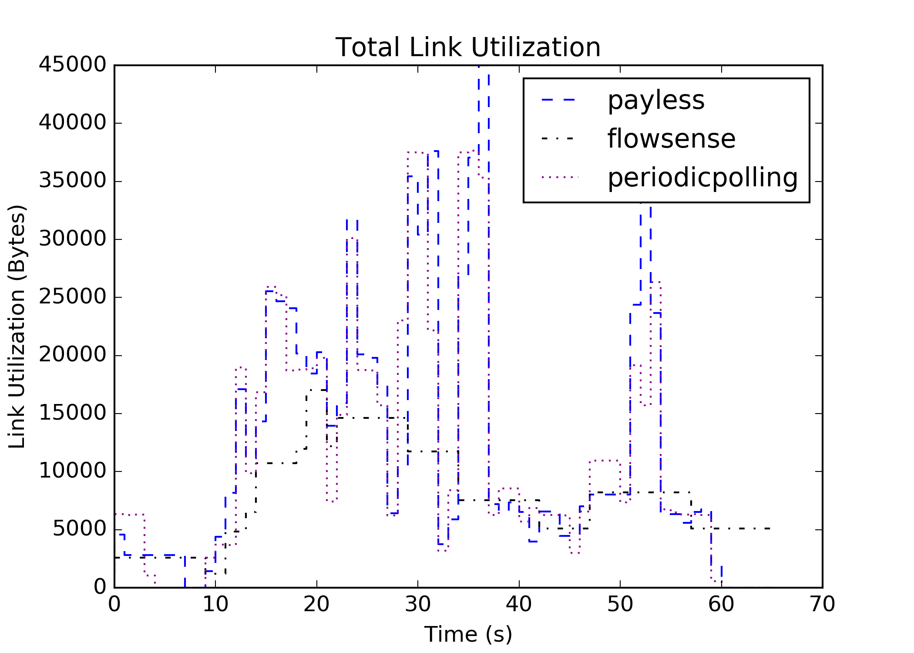
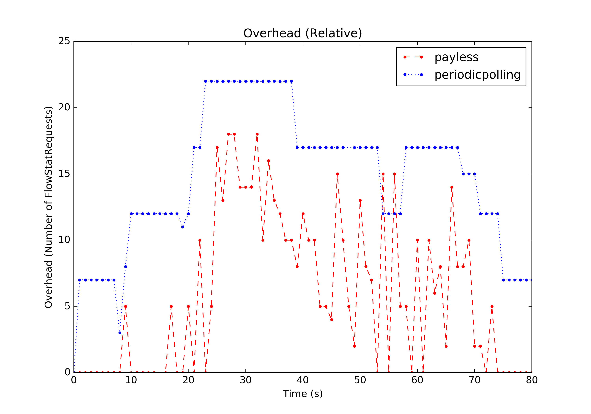
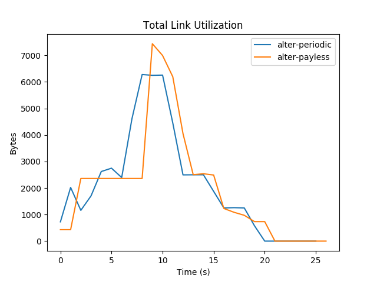
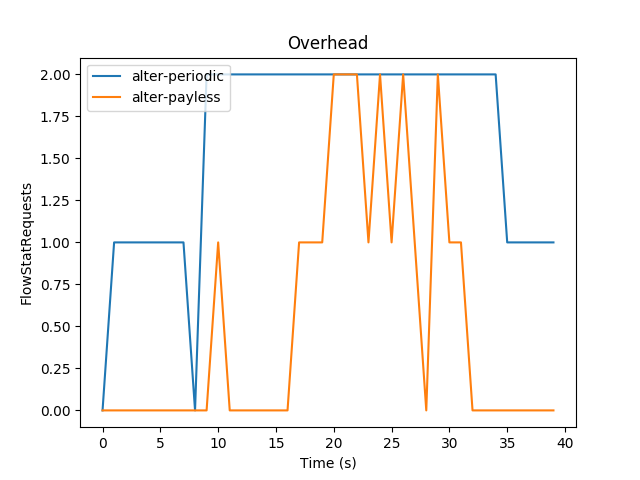
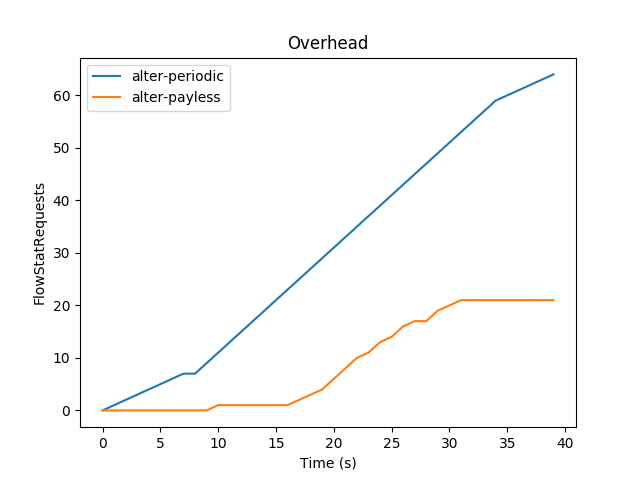

# Implementation of "Payless: A Low Cost Monitoring Framework for Software Defined Networks"

## Basic Usage / Running Experiments

To run an experiment, first set up the environment using

```
vagrant up
vagrant ssh
./setup.sh
```

Afterwards, experiments with custom topologies and scenarios can be run
using `run_experiment.py`.

For example, running the experiment described in the paper using the
adaptive monitoring algorithm and storing the resulting statistics in a file
called `payless.json`` can be done using the following command:

```
sudo python run_experiment.py scenario/topo-payless.yaml scenario/scene-payless.yaml payless-single-thread -o payless.json -v
```

For more information on the capabilities of `run_experiment.py`, run `run_experiment.py --help`

The resulting data can then be visualized using the following scripts:

* `g3-link-utilization`
* `g3-overhead`

When running in the vagrant VM, the `--out` option has to be used to save the
visualization to a file.

### Example

This section will walk trough running experiments using the payless adaptive
monitoring algorithm and periodic polling, then comparing them graphically
regarding link utilization and overhead.
This actually recreates figures 8 and 9 from the original paper.

First, run the experiments:

```
sudo python run_experiment.py scenario/topo-payless.yaml scenario/scene-payless.yaml payless -o payless.json -v
sudo python run_experiment.py scenario/topo-payless.yaml scenario/scene-payless.yaml periodicpolling -o periodicpolling.json -v
sudo python run_experiment.py scenario/topo-payless.yaml scenario/scene-payless.yaml flowsense -o flowsense.json -v
```

Next, visualize the link utilization and overhead:

```
g3-link-utilization total payless.json periodicpolling.json flowsense.json -o link_utilization.png
g3-overhead relative payless.json periodicpolling.json -o overhead.png
```
The results should look more or less like this:




### Example 2

This is another example using another topology defined in `topo-alter.yaml`, which contains only two hosts and one switch.

Traffic is generated with `scene-alter.yaml`.





## Running the API

To run the API, first set up the environment using

```
vagrant up
vagrant ssh
./setup.sh
```

Each monitoring request is stored locally in an SQLite database.

To set up the API with the server listening on `http://127.0.0.1:3000`, run the following Python script:
```
python api/app.py
```

You can interact with the API, using the RESTful API calls described in the paper. 
In contrast to the paper, the API can only request the json data **after** running the different experiments have been
conducted.

There are currently the following parameters supported:
- **metric**: `overhead` or `utilization`
- **monitor_type**: `adaptive` or `periodic_polling` 
- **aggregation_level**: `flow` or `switch`

## Request Examples
Post these code snippets into a separate Python file and run the Python file outside the Vagrant 
environment. 

1. Register a `MonitoringRequest`
```python
import requests
request = {
    "MonitoringRequest": {
        "metric": "utilization",
        "aggregation_level": "switch",
        "monitor": "adaptive"
    }
}
url = 'http://127.0.0.1:3000/payless/object/monitor_request/register'
res = requests.post(url, json=request)
if res.ok:
    print(res.content)
```

2. Delete a `MonitoringRequest`. You receive an access id after registering the monitoring request.
```python
import requests
access_id = 1 # Specify the access id 
url = 'http://127.0.0.1:3000/payless/object/monitor_request/delete/' + str(access_id)
res = requests.post(url)

if res.ok:
    print(res.content)
```

3. Retrieve the desired data according to the `MonitoringRequest`.
```python
import requests
access_id = 1 # Specify the access id 
url = 'http://127.0.0.1:3000/payless/log/retrieve/' + str(access_id)
res = requests.get(url)

if res.ok:
    print(res.content)
```

4. Update existing `MonitoringRequest`.
```python
import requests
access_id = 1 # Specify the access id 
new_request = {
    "MonitoringRequest": {
        "metric": "overhead",
        "aggregation_level": "flow",
        "monitor": "periodic_polling"
    }
}
url = 'http://127.0.0.1:3000/payless/object/monitor_request/update/' + str(access_id)
res = requests.post(url, json=new_request)

if res.ok:
    print(res.content)
```


## Environment Setup - Details

### Mininet

Mininet is responsible for setting up the topology. Use the following command to start mininet.

```
sudo mn -c && sudo python scenario/start_mininet.py scenario/topo-payless.yaml
```

- `sudo mn -c`: clean existing mininet topology and stop controller
- `start_mininet.py`: script to read configurations from a file and start the mininet application
- `topo-payless.yaml`: contains the layout of the network

After the load of the yaml file, the script will dump the connctions in the network and enter the minient CLI shell.

It is recommended to check if the interfaces are cleared or created as excepted before doing anything else.

The following output is expected.
```
Dumping connections
s0 lo:  s0-eth1:s1-eth1 s0-eth2:s2-eth1
s1 lo:  s1-eth1:s0-eth1 s1-eth2:s3-eth1 s1-eth3:s4-eth1
s2 lo:  s2-eth1:s0-eth2 s2-eth2:s5-eth1 s2-eth3:s6-eth1
s3 lo:  s3-eth1:s1-eth2 s3-eth2:h1-eth0 s3-eth3:h2-eth0
s4 lo:  s4-eth1:s1-eth3 s4-eth2:h3-eth0 s4-eth3:h4-eth0
s5 lo:  s5-eth1:s2-eth2 s5-eth2:h5-eth0 s5-eth3:h6-eth0
s6 lo:  s6-eth1:s2-eth3 s6-eth2:h7-eth0 s6-eth3:h8-eth0
h1 h1-eth0:s3-eth2
h2 h2-eth0:s3-eth3
h3 h3-eth0:s4-eth2
h4 h4-eth0:s4-eth3
h5 h5-eth0:s5-eth2
h6 h6-eth0:s5-eth3
h7 h7-eth0:s6-eth2
h8 h8-eth0:s6-eth3
mininet>
```

### Ryu controller

ryu is used to serve as the controller layer of the OpenFlow network. Use the following command to start your ryu application.

```
sudo ryu-manager src/simpleRemoteController.py
```

After all switches are connected. Check the installed flow rules in the mininet CLI:
```
mininet> dpctl dump-flows
```

### Traffic generation

Relevant Files:
```
scenario
├── eval_payless.py
├── packet_raw.py
├── send_raw.py
├── server_raw.py
└── scene-payless.yaml
```

- `eval_payless.py`: reads configuration of tasks from a `yaml` file and execute each task in a separate process.
- `packet_raw.py`: defines content of the packet to send. Used by `send_raw.py`.
- `send_raw.py`: main script for sending. Details see below.
- `server_raw.py`: listens to the given interface and calculates received bytes. Only useful for manual tests.
- `scene-payless.yaml`: defines tasks in the evaluation.

```sh
vagrant@ubuntu-xenial:/vagrant_data/g3/scenario$ m h1 sudo python send_raw.py --name task1 --interface h1-eth0 --start 0 --stop 4 --step 0.1 --number 1 --packet h1h8l800b --delay 1
# terminal output
[6578] task1 socket ready
[6578] task1 start at 1592843630.5969
[6578] task1 4000 bytes sent
[6578] task1 time spent: 4.0011
```
Note: Having a short delay before sending packets is important if several tasks need to be aligned to start at the same time.

If you would like to check the packet on the another side, go with the following command:
```sh
vagrant@ubuntu-xenial:/vagrant_data/g3/scenario$ m h8 sudo python server_raw.py h8-eth0
# terminal output
Socket ready
100 bytes received
100 bytes received
100 bytes received
...
```

Also, it is convenient to check the changes by dumping the flow rules in the mininet CLI:
```
mininet> dpctl dump-flows
...
cookie=0x0, duration=20.700s, table=0, n_packets=1, n_bytes=50, idle_age=5, priority=10,ip,nw_src=11.0.0.0/8,nw_dst=88.0.0.0/8 actions=output:2
...
```

Finally, it is possible to generate a sequence of traffic with the help of a `yaml` file. See examples in `scene-payless.yaml`.
```sh
vagrant@ubuntu-xenial:/vagrant_data/g3/scenario$ sudo python eval_payless.py scene-payless.yaml
# terminal output
[6286] task1 socket ready
[6288] task2 socket ready
[6286] task1 start at 1592843128.5555
[6288] task2 start at 1592843131.5635
[6286] task1 5000000 bytes sent
[6286] task1 time spent: 4.0005
[6265] task1 exited with 0
[6288] task2 2500000 bytes sent
[6288] task2 time spent: 2.0015
[6267] task2 exited with 0
```
